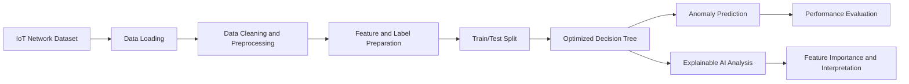

<div align="center">

# 🌐 IoT-XAI-Anomaly-Detection

### An Optimized Decision Tree-Based Framework for Explainable IoT Anomaly Detection

<p>
  
  
  
  
  
</p>

<p>
  A completed and published research implementation for interpretable IoT anomaly detection,
  attack-category modeling, and feature-level security insight extraction.
</p>

</div>

---

## ✅ Project Status

This repository documents a **completed and published research project**.
It contains the notebook-based implementation, dataset workflow, model training/evaluation pipeline,
and explainability analysis associated with the published paper.

---

## 🧭 Project Overview

IoT environments continuously generate heterogeneous traffic and telemetry. In such settings,
small behavioral deviations may indicate intrusions, malware activity, botnet behavior, or device misuse.

This project addresses that challenge with an **optimized Decision Tree-based framework** for IoT anomaly detection using the **WUSTL-EHMS-2020** dataset. The core emphasis is not only detection, but also **explainable AI (XAI)** so analysts can interpret why traffic is flagged.

### Why explainability matters in IoT security
- Operational teams need transparent security alerts, not only predicted labels.
- Feature-level interpretation supports faster incident triage.
- Interpretable models improve trust in ML-assisted security workflows.

---

## 🔬 Research Publication

**Paper Title:** *An Optimized Decision Tree-Based Framework for Explainable IoT Anomaly Detection*  
**Authors:** Ashikuzzaman; Md. Shawkat Hossain; Jubayer Abdullah Joy; Md. Zahid Akon; Md Manjur Ahmed; Md. Naimul Islam  
**Publisher:** IEEE  
**Venue:** 2025 IEEE 2nd International Conference on Computing, Applications and Systems (COMPAS 2025)  
**DOI:** https://doi.org/10.1109/COMPAS67506.2025.11381766

---

## 🧩 Methodology & Workflow



### Pipeline summary
1. Load and inspect IoT traffic data.
2. Clean/preprocess features and encode categorical variables where needed.
3. Prepare target labels for anomaly/attack-category prediction.
4. Split data into training and testing subsets.
5. Train Decision Tree model(s) and generate predictions.
6. Evaluate classification quality with standard metrics.
7. Analyze feature importance and explain model behavior.

---

## 📊 Dataset

- **Dataset source used in this repository:** WUSTL-EHMS-2020 (with attack categories)
- **Repository dataset file:** `wustl-ehms-2020_with_attacks_categories.csv`
- **Data type:** Structured IoT/network traffic records
- **Primary purpose:** IoT anomaly detection and attack-category analysis

> **Dataset licensing note:** Please check and follow the original dataset's terms before redistribution or external reuse.

---

## 📓 Notebook Implementation

Main notebook: `wustl_data_iot_(2).ipynb`

The notebook contains the end-to-end experimental flow, including:
- preprocessing and feature handling,
- model training (Decision Tree-centered workflow),
- evaluation using classification metrics,
- explainability/feature-importance analysis.

---

## 📈 Evaluation & XAI Scope

The workflow evaluates model behavior using common classification indicators such as:
- Accuracy
- Precision
- Recall
- F1-score
- Confusion matrix / classification report
- Cohen's Kappa (as used in the notebook workflow)
- Feature-importance interpretation

No unsupported benchmark values are reported here; see the notebook and publication for experiment outputs.

---

## ⚡ Reproducibility / Quick Start

### 1) Clone
```bash
git clone https://github.com/Ashikuzzaman026/IoT-XAI-Anomaly-Detection.git
cd IoT-XAI-Anomaly-Detection
```

### 2) Create and activate environment
```bash
python -m venv .venv
source .venv/bin/activate  # Linux/macOS
# .venv\Scripts\activate   # Windows PowerShell
```

### 3) Install notebook dependencies
```bash
pip install numpy pandas scikit-learn matplotlib seaborn jupyter shap SALib catboost scipy
```

### 4) Launch notebook
```bash
jupyter notebook "wustl_data_iot_(2).ipynb"
```

### 5) Run cells in sequence
Follow the notebook order for data preparation, training, evaluation, and explainability analysis.

> **Note:** This repository is notebook-first and does not currently provide a `requirements.txt` or standalone training script.

---

## 🗂️ Repository Structure

```text
IoT-XAI-Anomaly-Detection/
├── README.md
├── wustl_data_iot_(2).ipynb
├── wustl-ehms-2020_with_attacks_categories.csv
└── IoT Anomaly Detection.pdf
```

`IoT Anomaly Detection.pdf` is included in the repository and may contain project/paper-related material.

---

## 📚 Citation

### DOI citation
Ashikuzzaman; Md. Shawkat Hossain; Jubayer Abdullah Joy; Md. Zahid Akon; Md Manjur Ahmed; Md. Naimul Islam.  
*An Optimized Decision Tree-Based Framework for Explainable IoT Anomaly Detection*.  
2025 IEEE 2nd International Conference on Computing, Applications and Systems (COMPAS 2025), IEEE.  
DOI: https://doi.org/10.1109/COMPAS67506.2025.11381766

### BibTeX
```bibtex
@inproceedings{ashikuzzaman2025iotxai,
  title     = {An Optimized Decision Tree-Based Framework for Explainable IoT Anomaly Detection},
  author    = {Ashikuzzaman and Md. Shawkat Hossain and Jubayer Abdullah Joy and Md. Zahid Akon and Md Manjur Ahmed and Md. Naimul Islam},
  booktitle = {2025 IEEE 2nd International Conference on Computing, Applications and Systems (COMPAS)},
  year      = {2025},
  publisher = {IEEE},
  doi       = {10.1109/COMPAS67506.2025.11381766}
}
```

---

## ⚠️ Limitations

- The implementation is primarily notebook-based rather than a packaged production pipeline.
- Reported behavior can vary with preprocessing choices, splits, and hyperparameters.
- Generalization beyond this dataset should be validated on additional IoT data sources.
- Feature-importance explanations are model-behavior interpretations, not causal proof.

---

## 🔮 Future Research Directions

Although the main study is complete and published, extensions may include:
- comparison with additional ML/deep models,
- broader cross-dataset validation,
- richer explainability analyses,
- more deployment-oriented real-time IoT inference workflows.

---

## 📄 Repository License Note

No explicit repository license file is currently provided. Contact the repository owner before reusing or redistributing code/data beyond intended research use.

---

<div align="center">
  <sub>Completed and published research implementation for explainable, interpretable IoT anomaly detection.</sub>
</div>
